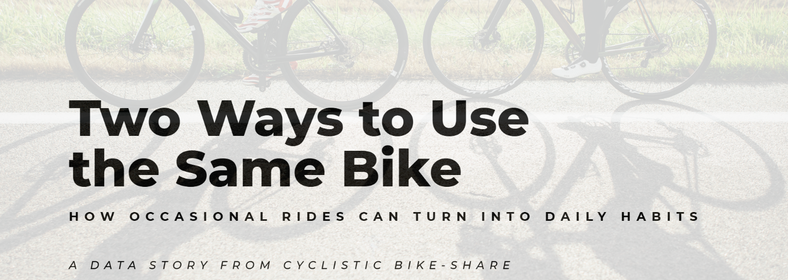

  

# 🚴‍♀️ Cyclistic Bike-Share Case Study

**Business-oriented data analysis**

## Project context

Cyclistic is a bike-share company based in Chicago.  
Although it offers different types of passes, its business model depends largely on **annual memberships**, as they represent the most profitable and stable user group.

The marketing team faces a key question:

> **How do annual members and casual riders use the service, and how can we convert casual riders into members?**

This project addresses that question by applying the complete data analysis process proposed in the **Google Data Analytics Professional Certificate**.

## Business objective

The main objective is to **understand the behavioral differences** between:

- **Annual members**
- **Casual riders**

Based on these patterns, the goal is to generate **actionable insights** that support marketing strategies focused on conversion.

In short:  
**turn occasional rides into long-term habits.**

## Analysis methodology

This project follows the **six phases of data analysis** defined by Google:

Ask · Prepare · Process · Analyze · Share · Act

The first four phases are documented in detail in the `/docs` folder.

The **Share** and **Act** phases are represented through the project slides and the landing page.

## Tools used

- **Microsoft Excel**: initial exploration, calculation validation, and manual cleaning
- **Google Sheets**: quick review of small files
- **SQL (BigQuery)**: full analysis of the annual dataset
- **Tableau**: data visualization and dashboards
- **GitHub**: version control and documentation

## Key findings (summary)

The analysis reveals clear and consistent differences:

- **Casual riders**

  - Take longer rides
  - Use the service mainly on weekends
  - Show more recreational and seasonal behavior

- **Annual members**
  - Take shorter rides
  - Use the service regularly during weekdays
  - Show functional and recurring usage

These differences explain why a generic marketing strategy is not effective for both groups.

## Visualizations and presentation

**Project slides (Share phase):**  
[View PDF presentation](slides/0506_Share_Act_Case_Study.pdf)

## Project landing page (Act phase)

As part of the **Act** phase, this project includes a simple landing page that simulates the launch of marketing campaigns aimed at converting casual riders into annual members.

https://sara-gavi.github.io/cyclistic-landing-case-study/

## Data notes

The `data` folder contains **example datasets only**, used for demonstration and visualization purposes.

## Author

**Sara Gavilán**  
Full Stack Developer · Data Analytics · Creativity

Project developed as part of the **Google Data Analytics Professional Certificate**.

---

# 🚴‍♀️ Cyclistic Bike-Share Case Study

**Análisis de datos orientado a negocio**

## Contexto del proyecto

Cyclistic es una empresa de bicicletas compartidas con sede en Chicago.  
Aunque ofrece diferentes tipos de pases, su modelo de negocio depende en gran medida de las **membresías anuales**, ya que representan el grupo de usuarios más rentable y estable.

El equipo de marketing se enfrenta a una pregunta clave:

> **¿Cómo usan el servicio los miembros anuales y los usuarios ocasionales, y cómo podemos convertir a estos últimos en miembros?**

Este proyecto aborda esa pregunta aplicando el proceso completo de análisis de datos propuesto en el **Google Data Analytics Professional Certificate**.

## Objetivo de negocio

El objetivo principal es **entender las diferencias de comportamiento** entre:

- **Miembros anuales**
- **Usuarios ocasionales**

A partir de estos patrones, se busca generar **insights accionables** que apoyen estrategias de marketing orientadas a la conversión.

En pocas palabras:  
**convertir trayectos ocasionales en hábitos a largo plazo.**

## Metodología de análisis

El proyecto sigue las **seis fases del análisis de datos** definidas por Google:

Ask · Prepare · Process · Analyze · Share · Act

Las cuatro primeras fases están documentadas en detalle en la carpeta `/docs`.

Las fases de **Share** y **Act** se representan a través de las slides del proyecto y la landing page.

## Herramientas utilizadas

- **Microsoft Excel**: exploración inicial, validación de cálculos y limpieza manual
- **Google Sheets**: revisión rápida de archivos pequeños
- **SQL (BigQuery)**: análisis completo del dataset anual
- **Tableau**: visualización de datos
- **GitHub**: control de versiones y documentación

## Resultados clave (resumen)

El análisis revela diferencias claras y consistentes:

- **Usuarios ocasionales**

  - Realizan viajes más largos
  - Usan el servicio principalmente los fines de semana
  - Presentan un comportamiento más recreativo y estacional

- **Miembros anuales**
  - Realizan viajes más cortos
  - Usan el servicio de forma regular entre semana
  - Muestran un uso funcional y recurrente

Estas diferencias explican por qué una estrategia de marketing genérica no es efectiva para ambos grupos.

## Visualizaciones y presentación

**Slides del proyecto (fase Share):**  
[Ver presentación en PDF](slides/0506_Share_Act_Case_Study.pdf)

## Landing page del proyecto (fase Act)

Como parte de la fase **Act**, este proyecto incluye una landing page sencilla que simula la puesta en marcha de campañas de marketing dirigidas a convertir a los usuarios ocasionales en miembros anuales.

https://sara-gavi.github.io/cyclistic-landing-case-study/

## Notas sobre los datos

La carpeta `data` contiene **solo datos de ejemplo**, usados con fines demostrativos y de visualización.

## Autora

**Sara Gavilán**  
Full Stack Developer · Análisis de Datos · Creatividad

Proyecto realizado como parte del **Google Data Analytics Professional Certificate**.
